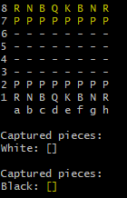

<h1>Objetivo</h1>

Desenvolver um sistema de xadrez em Java no qual é possível duas pessoas jogarem xadrez através de comando no teclado.

<h1>Requerimentos</h1>

Ter um prompt de comando com suporte a cores.

<h1>Como usar</h1>

Baixe o projeto;

Vá até a pasta ‘bin’ do projeto;

Com um prompt de comando aberto digite o comando “java application/Program”.

<h1>Resultado</h1>

